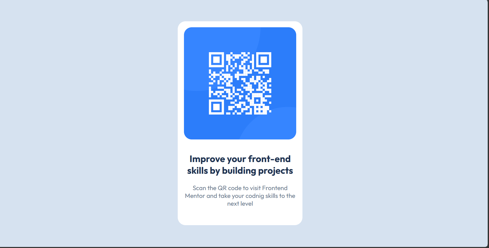

# Frontend Mentor - QR code component solution

This is a solution to the [QR code component challenge on Frontend Mentor](https://www.frontendmentor.io/challenges/qr-code-component-iux_sIO_H). Frontend Mentor challenges help you improve your coding skills by building realistic projects.

## Table of contents

- [Overview](#overview)
  - [Links](#links)
- [My process](#my-process)
  - [Built with](#built-with)
  - [What I learned](#what-i-learned)
  - [Continued development](#continued-development)
  - [AI Collaboration](#ai-collaboration)

## Overview

This is QR code card for Forntend Mentor website

### Screenshot



### Links

- Solution URL: (https://github.com/moha2002yobn-wq/QR-component.git)
- Live Site URL: (https://moha2002yobn-wq.github.io/QR-component/)

## My process

### Built with

- Semantic HTML5 markup
- CSS custom properties
- Flexbox

### What I learned

I learned how to use flexbox to center elemnts in the middle of the body

To see how you can add code snippets, see below:

```css
body {
  min-height: 100vh;
  margin: 0;
  display: flex;
  align-items: center;
  justify-content: center;
}
```

### Continued development

I use div to create the card for presentation purpose but i feel ther's somthing better

I use in the card div iamage and one div for h2 and p i thing better to use to divs

**Note: Delete this note and the content within this section and replace with your own plans for continued development.**

### AI Collaboration

Describe how you used AI tools (if any) during this project. This helps demonstrate your ability to work effectively with AI assistants.

- ChatGPT
- used to help how use flexbox to center element in the middle
